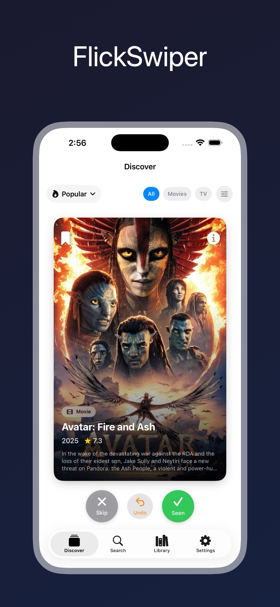
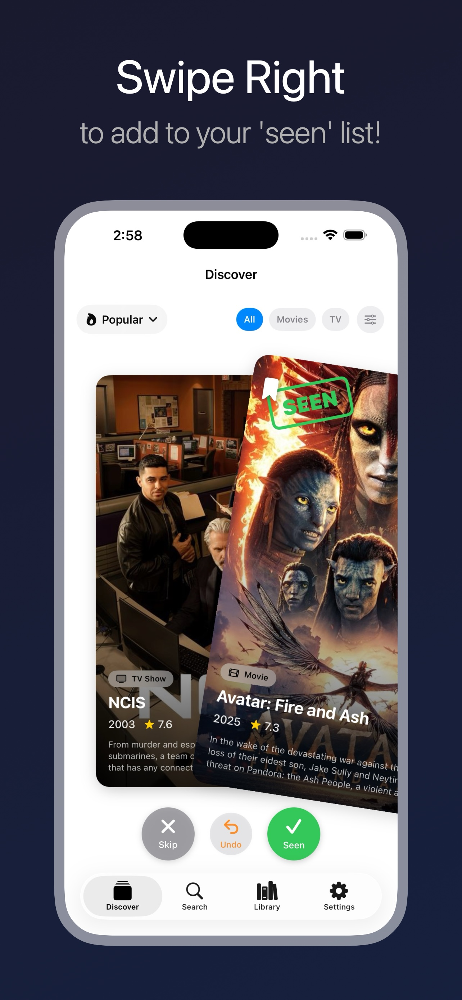
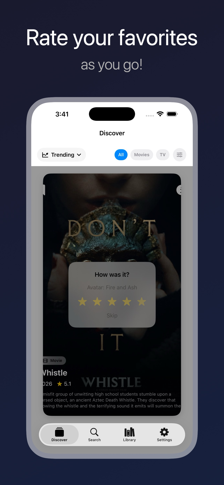
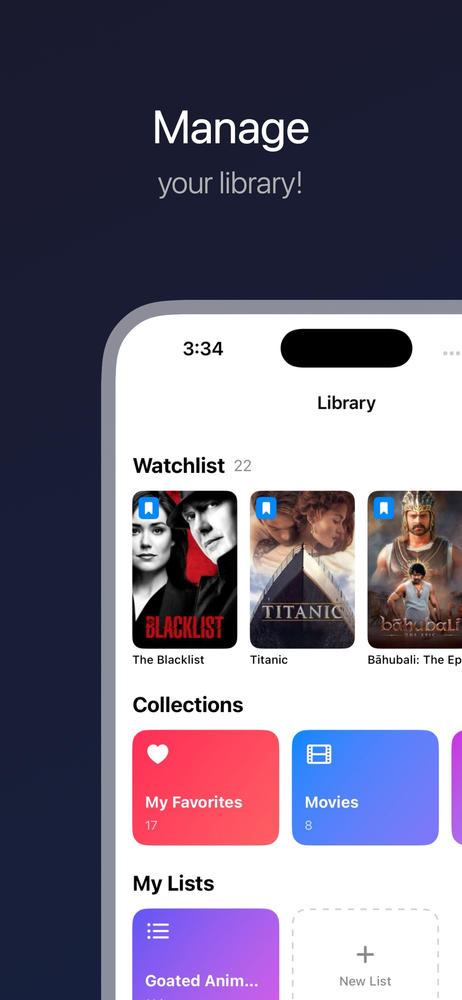
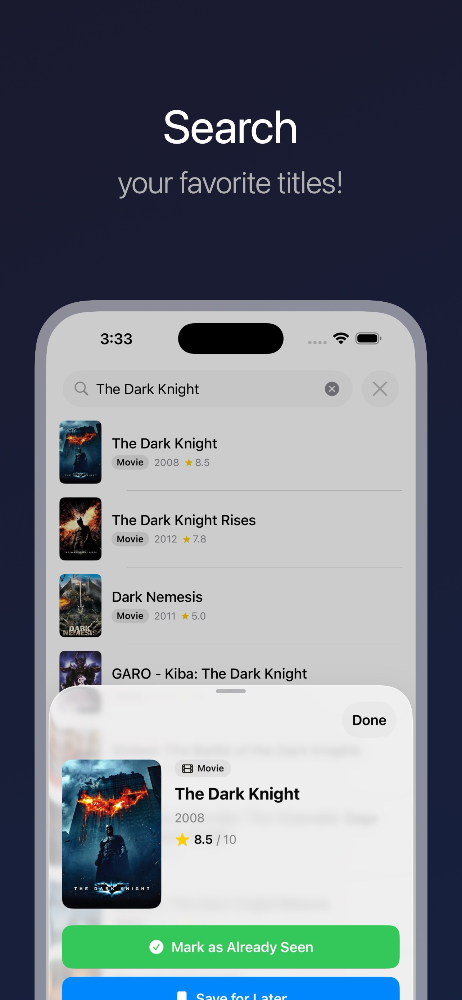

# FlickSwiper

**A gesture-driven iOS app for discovering, tracking, and organizing movies & TV shows — with social list sharing and cloud sync.**

[](https://github.com/mit112/FlickSwiper/actions/workflows/build.yml)
[](https://swift.org)
[](https://developer.apple.com/swiftui/)
[](https://developer.apple.com/documentation/swiftdata)
[](https://firebase.google.com/)
[](https://developer.apple.com/ios/)
[](LICENSE)

<p align="center">
  
  
  
  
  
</p>

## Overview

FlickSwiper brings a Tinder-style swipe interface to movie and TV show discovery. Swipe right to mark something as seen, left to skip, or up to save it to your watchlist. The app pulls content from [The Movie Database (TMDB)](https://www.themoviedb.org/) and stores your library locally with SwiftData, with optional Firebase-backed cloud sync and social list sharing.

### Why I Built This

I wanted a quick, tactile way to log what I've watched without the overhead of full-featured tracking apps. The swipe mechanic makes it feel like a game rather than a chore, and the library features grew organically from there. Social lists and cloud sync came next — sharing a "best sci-fi" list via a Universal Link felt like the right way to extend the concept.

## Features

**Discover** — Browse trending, popular, top-rated, now playing, upcoming, and 11 streaming services. Filter by genre, year range, and content type. Sort streaming catalogs by popularity, rating, release date, or alphabetically.

**Swipe & Rate** — Swipe right (seen), left (skip), or up (watchlist). Haptic feedback on threshold crossing and velocity-based fly-off animations. After marking something as seen, an inline rating prompt (1–5 stars) appears with spring-animated star selection.

**Search** — Debounced TMDB search with instant results. Green checkmarks and amber bookmarks indicate items already in your library or watchlist.

**Library** — Smart collections auto-generated from your data (favorites, genres, platforms, recently added). Create custom lists, add items individually or in bulk via a full-screen selectable grid. Apple-style edit mode with multi-select, bulk delete, and share. Configurable rating display (TMDB, personal, or none) under posters.

**Watchlist → Seen** — When you finally watch something, tap "I've Watched This" to move it from watchlist to seen with a rating prompt.

**Social Lists** — Sign in with Apple or Google to publish custom lists as Universal Links. Share via `flickswiper.app/list/{id}`. Friends can follow your lists with real-time sync — when you update a published list, followers see the changes automatically via Firestore snapshot listeners.

**Cloud Backup** — Optional bidirectional sync backs up your entire library (swipes, ratings, lists, list entries) to Firebase. Push-on-write for instant saves, incremental pull on launch. Merge conflicts resolved by timestamp with direction hierarchy protection (seen > watchlist > skipped). Supports cross-provider account switching with full data isolation.

## Technical Highlights

- **SwiftData with Versioned Schema Migration** — Four-version migration chain (V1→V2→V3→V4) with frozen versioned schema definitions to prevent hash mismatches. UUID-based join models (`UserList` ↔ `ListEntry` ↔ `SwipedItem`) avoid SwiftData relationship pitfalls.
- **Firebase Integration** — Auth (Apple + Google Sign-In with provider-aware collision handling), Firestore (cloud sync + social list publishing), Security Rules with penetration-tested authorization layer.
- **Bidirectional Cloud Sync** — Push-on-write with incremental pull. Timestamp-based merge with direction hierarchy protection. Chunked batch uploads (400 ops). Cross-provider account switch with data isolation.
- **Actor-Isolated Networking** — `TMDBService` is an `actor`, ensuring thread-safe API access. Handles 429 rate limiting with automatic retry using the `Retry-After` header.
- **Gesture-Driven Animation Orchestration** — Card swipe animations in three directions with precise timing between fly-off animation (0.2s delay), array mutation, and rating prompt presentation to prevent visual artifacts.
- **Real-Time Social Sync** — Per-list Firestore snapshot listeners for followed lists. Activate/deactivate lifecycle tied to auth state.
- **Image Caching & Prefetch** — Enlarged `URLCache` (50MB memory / 200MB disk) with a custom `RetryAsyncImage` wrapper that retries failed loads with shimmer loading state and fade-in transitions. Prefetches both w500 posters and w185 thumbnails.
- **Direction Transition Policy** — Hierarchical protection (seen > watchlist > skipped) prevents user data demotions. State-aware undo via `UndoEntry` struct tracking.
- **Protocol-Oriented Service Layer** — `MediaServiceProtocol` with a `MockMediaService` ready for unit testing.
- **Accessibility** — Custom accessibility actions on swipe cards, descriptive labels on all interactive elements, proper modifier ordering.

For a deeper look at architecture decisions, see [ARCHITECTURE.md](ARCHITECTURE.md). For a history of changes, see [CHANGELOG.md](CHANGELOG.md).

## System Design At a Glance

- **UI architecture**: SwiftUI + MVVM with `@Observable` view models and actor-isolated service calls.
- **Data ownership**: `SwipedItemStore` centralizes write operations with cloud sync hooks so views stay focused on presentation.
- **Persistence**: SwiftData with a four-version migration plan (`FlickSwiperMigrationPlan`, V1→V4) and three-tier startup recovery fallback.
- **Cloud layer**: Firebase Auth (Apple + Google) → `CloudSyncService` (push-on-write + incremental pull) → Firestore subcollections under `users/{uid}/`.
- **Social layer**: `ListPublisher` (publish/unpublish lifecycle) + `FollowedListSyncService` (per-list Firestore snapshot listeners) + Universal Links via GitHub Pages AASA.
- **Networking**: `TMDBService` actor handles API requests, retry-on-429 behavior, and model mapping to `MediaItem`.
- **Testing strategy**: XCTest coverage for models, decoding, service/view-model behavior, and persistence mutation paths via in-memory SwiftData. Firestore security rules validated by 51-test penetration testing suite.

## Project Structure

```
FlickSwiper/
├── FlickSwiperApp.swift              # App entry, URLCache, ModelContainer, Firebase, environment injection
├── ContentView.swift                 # Tab nav, auth state observer, deep link handler, periodic sync
├── Config/                           # xcconfig-based API key management
├── Models/
│   ├── SwipedItem.swift              # SwiftData model — swipes, ratings, genres, platform, sync fields
│   ├── MediaItem.swift               # Unified media type for UI consumption
│   ├── TMDBModels.swift              # TMDB API response decodables
│   ├── SchemaVersions.swift          # Frozen versioned schemas (V1–V4) + migration plan
│   ├── UserList.swift / ListEntry.swift  # Custom list models (UUID join) + publish/sync fields
│   ├── FollowedList.swift            # SwiftData cache for followed social lists
│   ├── FollowedListItem.swift        # Items within a followed list
│   ├── DiscoveryMethod.swift         # Discovery methods + streaming provider config
│   ├── Genre.swift                   # Genre model for filtering
│   ├── StreamingSortOption.swift     # Sort options for streaming content
│   └── RatingDisplayOption.swift     # User preference for grid card ratings
├── ViewModels/
│   ├── SwipeViewModel.swift          # Discovery feed, swipe logic, filtering, cloud sync hooks
│   └── SearchViewModel.swift         # Debounced search with Task cancellation
├── Views/
│   ├── Discover/                     # Swipe cards, filters, rating prompt, tutorial
│   ├── Library/                      # Collections, lists, watchlist, grids, following section
│   ├── Social/                       # Sign-in prompt, shared list view, followed list views
│   ├── SearchView.swift              # Search tab with library-aware results
│   └── SettingsView.swift            # Settings, account management, cloud backup, reset actions
├── Services/
│   ├── TMDBService.swift             # Actor-based TMDB API client
│   ├── MediaServiceProtocol.swift    # Protocol + mock for testing
│   ├── AuthService.swift             # Firebase Auth — Apple + Google Sign-In, account lifecycle
│   ├── CloudSyncService.swift        # Bidirectional Firestore sync, merge, batch upload
│   ├── FirestoreService.swift        # Firestore CRUD for social lists
│   ├── ListPublisher.swift           # Publish/unpublish/sync lifecycle for shared lists
│   └── FollowedListSyncService.swift # Real-time snapshot listeners for followed lists
└── Utils/
    ├── Constants.swift               # App-wide constants + Firebase/deep link URLs
    ├── DeepLinkHandler.swift         # Universal Link URL parser
    ├── DisplayNameValidator.swift    # Display name format + offensive term validation
    ├── ShareLinkSheet.swift          # UIActivityViewController wrapper
    ├── NetworkError.swift            # Offline detection utility
    ├── Extensions.swift              # Helper extensions
    ├── GenreMap.swift                # TMDB genre ID → name/icon mapping
    ├── HapticManager.swift           # Haptic feedback patterns
    └── RetryAsyncImage.swift         # AsyncImage with retry + shimmer loading
```

## Getting Started

### Requirements

- iOS 26.0+
- Xcode 26+
- A free [TMDB API Key](https://www.themoviedb.org/settings/api)
- A Firebase project (for auth and cloud sync features)

### Setup

1. Clone the repo:
   ```bash
   git clone https://github.com/mit112/FlickSwiper.git
   cd FlickSwiper
   ```

2. Configure your API key:
   ```bash
   cp FlickSwiper/Config/Secrets.xcconfig.template FlickSwiper/Config/Secrets.xcconfig
   ```
   Open `Secrets.xcconfig` and replace `YOUR_TOKEN_HERE` with your TMDB API Read Access Token (v4 auth).

3. Set up Firebase:
   - Create a project at [Firebase Console](https://console.firebase.google.com/)
   - Register your iOS app (bundle ID: `com.flickswiper.app`)
   - Download `GoogleService-Info.plist` and add it to the Xcode project
   - Enable Apple and Google sign-in providers in Firebase Authentication

4. Open `FlickSwiper.xcodeproj` in Xcode and run (⌘R).

> **Note:** `Secrets.xcconfig` and `GoogleService-Info.plist` are gitignored. You need to create them locally before building.

## Tech Stack

| Layer | Technology |
|-------|-----------|
| UI | SwiftUI |
| Persistence | SwiftData with versioned schema migration (V1–V4) |
| Backend | Firebase Auth (Apple + Google) + Firestore |
| Networking | URLSession + async/await, actor isolation |
| API | TMDB v3 (movies, TV, search, streaming providers) |
| Architecture | MVVM with @Observable |
| Security | Firestore Security Rules, penetration tested (51 tests) |
| Minimum Target | iOS 26.0 |

## Privacy

Core library data is stored locally on device using SwiftData. Accounts are optional — signing in with Apple or Google enables cloud backup and social list sharing via Firebase. Published list data (list name, item metadata, display name) is stored in Firestore and visible to anyone with the share link. No third-party analytics or ad tracking. See the full [Privacy Policy](https://mit112.github.io/FlickSwiper/).

## License

This project is licensed under the MIT License — see the [LICENSE](LICENSE) file for details.

## Acknowledgments

- Movie and TV show data provided by [The Movie Database (TMDB)](https://www.themoviedb.org/). This app uses the TMDB API but is not endorsed or certified by TMDB.
